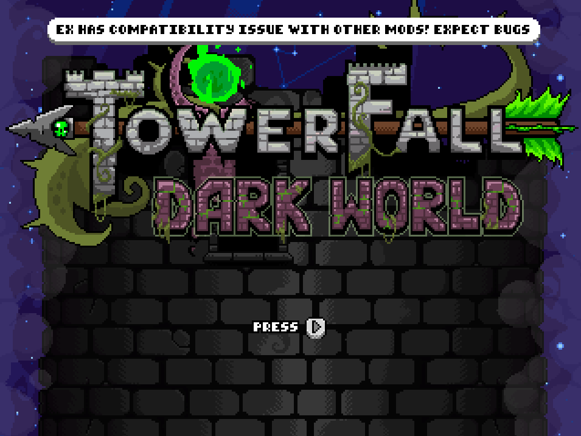

# Overview

EX creates an API for other mods to interact with it. Right now, it uses 3 functions:

```C#
 /// <summary>
 /// Register custom SaveState/LoadState events for a variant.
 ///
 /// <para>Those are used by EX rollback system to properly save/load variant custom properties</para>
 /// </summary>
public static Action<FortModule, string, Func<string>, Action<string>> RegisterVariantStateEvents;
```

```C#
 /// <summary>
 /// Mark a module as EX safe.
 ///
 /// <para>This is only to prevent EX showing a warning when a mod is loaded.</para>
 ///
 /// <para> It does not automatically mean the mod is compatible with EX and test should be done first. </para>
 /// </summary>
public static Action<FortModule> MarkModuleAsSafe;
```

```C#
/// <summary>
/// Determine if the game is currently playing online.
///
/// <para>Might be useful if a mod want to trigger some action</para>
/// </summary>
public static bool IsPlayingOnline;
```

`MarkModuleAsSafe` is used to prevent showing this notification


⚠ Again, this does not make the mod compatible, it only prevents showing the compatibility notification, so only use this if you know your mod is compatible! ⚠

# Modded variants

EX has the ability to run custom variants as long as the mod is made compatible with EX.

It's your responsibility to make sure the mod is netplay compatible (Ask the mod author)

## Making a custom variant compatible (For developers)

This guide will help you implement your modded variant for netplay sessions.

Note that this isn't a simple process as both mods can conflict.

You can also look at this [PR](https://github.com/FortRise/ExampleFortRiseMod/pull/1) which makes Jester Hat variant compatible with EX

### Prerequisites

There are 3 rules of thumb (and the first one is very important) for making your mod compatible:

- Your mod does not interfere with EX patches. There isn't a specific rule but some EX patches require initial setup before executing the original method.

So for example, some EX patches check some RNG call to be able to track them; patching the same function make the original get called without being able to register the RNG stuff. (Maybe in the future, this will be handled differently)

You can check `TF.EX.Patchs` project to see what's being patched. I don't have a good solution right now other than contacting me to see how your patches are going to affect EX patches.

- Your custom variant acts deterministically. That means applying the same input on an X frame always results in the same Y frame, every time with no exception.

- Your are only saving/loading the custom part of your variant. That means you shouldn't try (for example) to save the players position, because it's already made by EX. You should only focus on the things that are specific to your mod.

### Context

Although I recommend having at least a basic knowledge of how rollback netcode works (there are some great explanations/videos on the web), it's not mandatory for making the mod compatible.

EX already manages the work of saving/loading important pieces of information (State), it only needs what should be saved/loaded from your mod.

It uses an interop API to be able to let your mod interact with it.

```C#
public static Action<FortModule, string, Func<string>, Action<string>> RegisterVariantStateEvents;
```

This function takes 4 parameters:

- A FortModule(aka your core mod) used for identification
- A string that is the name of the modded variant
- A function that returns a string (SaveState)
- A function that takes a string (LoadState)

Let's look at the last two since they are more important:

- The SaveState delegate: a function that will return a serialized version of the custom variant state as a string.

That means it's your responsibility to know what your custom variant adds to the game.

- The LoadState delegate: a function that takes a serialized version of the mod state and expects you to load it.

### Implementation

#### Import the mod

This is straightforward. Create a class like this one:

```C#
    [ModImportName("TF.EX.API")]
    public static class TfExAPIModImports
    {
        public static Action<FortModule, string, Func<string>, Action<string>> RegisterVariantStateEvents;

        static TfExAPIModImports()
        {
            typeof(TfExAPIModImports).ModInterop();
        }
    }
```

`[ModImportName("TF.EX.API")]` is for MonoMod to be able to find EX mod.

`static TfExAPIModImports()` is just the constructor that will automatically make MonoMod detect EX mod.

#### Register the custom Save/Load delegate

Call the previous delegate with something like this:

```C#
TfExAPIModImports.RegisterVariantStateEvents(this, "customVariantName", OnSaveState, OnLoadState);
```

with OnSaveState being your save state delegate and OnLoadState being your load state delegate

Note the register function should be called **after** all mods finish loading, not while the mod is loading.
For now, you can do it using the FortRise event `FortRise.RiseCore.Events.OnPreInitialize`

### Test

You can test by launching EX in **test mode**, which is a special mode that triggers a rollback every check_distance frame and checks if the state on each frame is the same. (equality by checksum)

For example, with a check_distance at 2, the game will rollback every 2 frames.

If there is a checksum mismatch, there will be an exception thrown that will show why the mismatch happened. (DeepEqual.dll is needed for that!)

You can launch EX test mode by launching Towerfall, open the console by pressing ² and paste a command like

`test LMS 1 2 3 4 JESTERS_HAT`

with

- test : the mode we are lauching
- LMS : Last Man Standing
- 1 : the level where we should start
- 2 : the map where we should play
- 3 : the seed (for RNG) we want to apply
- 4 : the check distance (can be from 2 to 7)
- JESTERS_HAT: the title name of the variant we want to test, with spaces replaced by underscores
