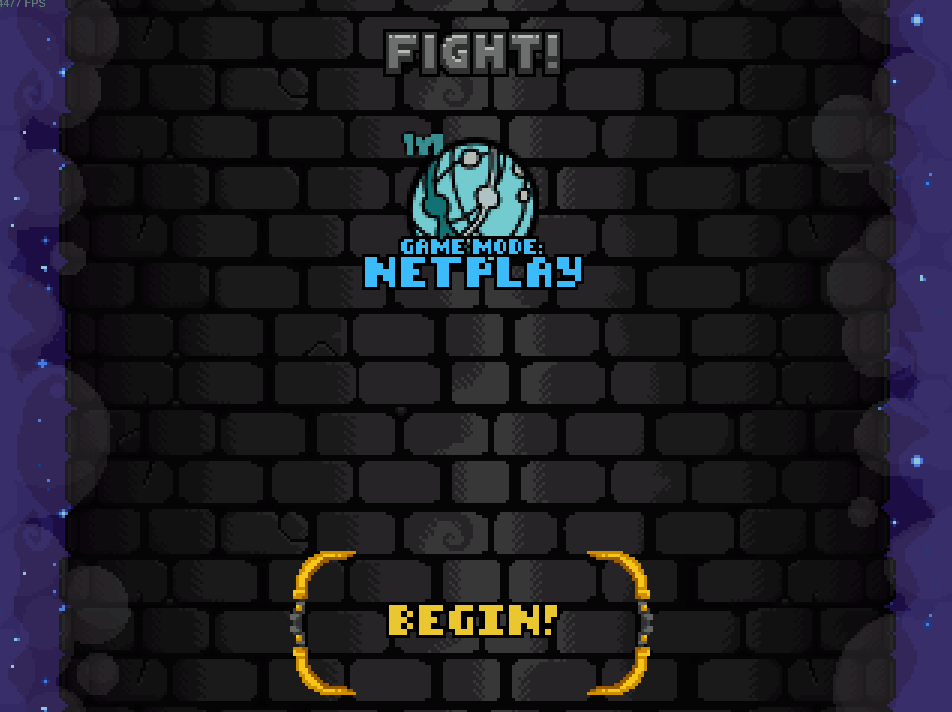
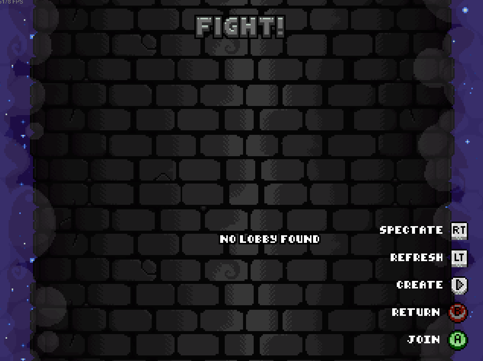

<!-- PROJECT LOGO -->
<br />
<div align="center">
  <a href="https://github.com/Fcornaire/TF.EX">
    
  </a>
  <h3 align="center">TF EX mod</h3>
</div>

<!-- Shield -->

[](https://patreon.com/DShadModdingAdventure)
[![Contributors][contributors-shield]][contributors-url]
[![Download][download-shield]][download-url]
[![Forks][forks-shield]][forks-url]
[![Stargazers][stars-shield]][stars-url]
[![Issues][issues-shield]][issues-url]
[![MIT License][license-shield]][license-url]

<!-- ABOUT THE PROJECT -->

# About The Project

TF EX is a mod that attempts to bring netplay to TowerFall (EX as in a Fighting game EX move, usually costing meter). It uses [FortRise](https://github.com/Terria-K/FortRise) (the supported version is [4.7.2](https://github.com/FortRise/FortRise/releases/tag/4.7.2) , there is a [pre release](https://github.com/Fcornaire/TF.EX/releases/tag/1.0.0-rc) compatible with 5.0.0)+ Rollback netcode as infrastructure.
Due to the nature of the project, the mod is also able to record + view previous matches.
Also, this project is still WIP!

# Features

- Online Netplay

<p align="center">
  
</p>

1 new mode available, `Netplay`

<p align="center">
  
</p>

Create a lobby for some online action!

<p align="center">
  
</p>

Or join an available one

<p align="center">
  
</p>

Or even spectate! (Experimental)

<p align="center">
  
</p>

- Modded variants

  Ability to run online play with custom variants as long as they are EX compatible. Read [EX API](EX-API.md) for mor details.

  <p align="center">
    
  </p>

- Replays

  Replay is "normally" automatically exported at the end of a game.
  Use the `replays` menu to watch precedent games

  <p align="center">
    
  </p>

  <p align="center">
    
  </p>

# Usage

It fairly easy to install this mod:

1. Install [FortRise](https://github.com/Terria-K/FortRise) with Debug ON , this can be changed by modifying the ```PatchVersion.txt``` file in the Towerfall root directory
> [!WARNING]  
> The last supported version is [4.7.2](https://github.com/FortRise/FortRise/releases/tag/4.7.2), This mean the mod won't load/work on version 5.X.X and beyond (PS : there is a [pre release](https://github.com/Fcornaire/TF.EX/releases/tag/1.0.0-rc) compatible with 5.0.0).
> Effort will be made to upgrade at some point
2. Download the latest TF EX [release](https://github.com/Fcornaire/TF.EX/releases)
3. Create a `Mods` directory at the root of your Towerfall install directory if not done already
4. Extract the `TF.EX` zip into the `Mods` folder.
5. You are now ready and the mod should be referenced and loaded by FortRise when the game starts

You have the option to change your username in the in-game options.
You can also change the input delay, but leaving it at 2 is usually fine.

You should also be able to see a new versus mode called Netplay (all the way to the right). This allows you to create and join online lobbies.

If you've played some matches, a `Replays` directory should have been created in the Towerfall root directory.
You can view the replays by:

1. Launching Towerfall
2. In the main menu, press ` to open it and enter the following command

```
replay {replay_name}
```

whith {replay_name} being something like "20-06-2023T22-17-46" (No file extension)

# Troubleshooting

I advise to not use this mod with mods that do other things than cosmetics/skins.
For example, [WiderSetMod](https://github.com/Terria-K/WiderSetMod) has been reported to break the mod.
I will try to investigate why it's happening but for now, only use the TF EX mod by itself.

# Develop

This project uses:

- [FortRise](https://github.com/Terria-K/FortRise) as the main loader (C#)
- [ggrs-ffi](https://github.com/Fcornaire/ggrs-ffi) which is a library that allows the [GGRS](https://github.com/gschup/ggrs) API to be called by non-rust projects (Rust)
- [matchbox-client-ffi](https://github.com/Fcornaire/matchbox-client-ffi) which is a library that allows the [matchbox](https://github.com/johanhelsing/matchbox) API to be called by non-Rust projects (Rust)
- A matchmaking server which is closed source for now, it manages matchmaking and also runs a signaling endpoint for easier connection (Rust)

## Installation

To be able to add features or fix things, you will need to:

1. Clone the repo

   ```sh
   git clone https://github.com/Fcornaire/TF.EX.git
   ```

2. Launch the .sln with your favorite IDE
3. Do some modifications and build. If you didn't change Towerfall original installation folder, the mod dll will be copied automatically each build to your game Towerfall directory. Be aware that with the exception of Core.dll, the others are copied to the root of Towerfall installation directory which lets us debug.
4. Launch Towerfall and on the main screen, open the Dev console wih the key ² (If not opening, ensure you enabled dev console in the game settings) and enter the following command

```
test LMS 0 1 42 2
```

A Last Man Standing game should be running in a GGRS [SyncTestSession](https://github.com/gschup/ggrs/wiki/2.-Sessions#sessionbuilder)

<!-- ROADMAP -->

## Roadmap

As you can guess, this project is still WIP and missing a lot of features:

- [ ] Automatically bump the version (meta + tag)
- [ ] Refactor (There is a lot of things I want to refactor)
- [x] Less restrictive controller
- [ ] Fix bugs
- [x] Fix desynchronization (At least netplay code wise should be fine)
- [ ] Support for all versus maps
- [ ] Check Twilight Spire CrackedWall with teams on level 7
- [ ] Support all items
- [ ] Support 4 players (FFA and 2V2 teams )
- [x] Integrate the replay viewer in the menu

## Contributing

What's the point of Github without contributions? Any contributions you make are **greatly appreciated**.
But since there is a ton of things to do, I advise either contact me directly or create an issue explaining the missing feature or the bug fix before starting to code. This is only so I know what you are tying to do, provide help if needed and check if it's not already done or in the works 😉

1. Fork the Project
2. Create your Feature Branch (`git checkout -b feature/cool-feature`)
3. Commit your Changes (`git commit -m 'feat: Add some cool Feature'`)
4. Push to the Branch (`git push origin feature/cool-feature`)
5. Open a Pull Request

<!-- LICENSE -->

## License

Distributed under the GPL-2.0 License. See `LICENSE` for more information.

The netplay logo can be found at [Icones8](https://icones8.fr/)

## Contact

Twitter : DShad - [@DShad66](https://twitter.com/DShad66)

Discord : dshad (was DShad#4670)

<!-- MARKDOWN LINKS & IMAGES -->
<!-- https://www.markdownguide.org/basic-syntax/#reference-style-links -->

[contributors-shield]: https://img.shields.io/github/contributors/Fcornaire/TF.EX.svg?style=for-the-badge
[contributors-url]: https://github.com/Fcornaire/TF.EX/graphs/contributors
[forks-shield]: https://img.shields.io/github/forks/Fcornaire/TF.EX.svg?style=for-the-badge
[forks-url]: https://github.com/Fcornaire/TF.EX/network/members
[stars-shield]: https://img.shields.io/github/stars/Fcornaire/TF.EX.svg?style=for-the-badge
[stars-url]: https://github.com/Fcornaire/TF.EX/stargazers
[issues-shield]: https://img.shields.io/github/issues/Fcornaire/TF.EX.svg?style=for-the-badge
[issues-url]: https://github.com/Fcornaire/TF.EX/issues
[license-shield]: https://img.shields.io/github/license/Fcornaire/TF.EX.svg?style=for-the-badge
[download-shield]: https://img.shields.io/github/downloads/Fcornaire/TF.EX/total?style=for-the-badge
[download-url]: https://github.com/Fcornaire/TF.EX/releases
[license-url]: https://github.com/Fcornaire/TF.EX/blob/master/LICENSE.txt
