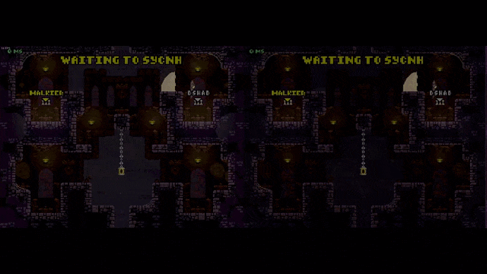
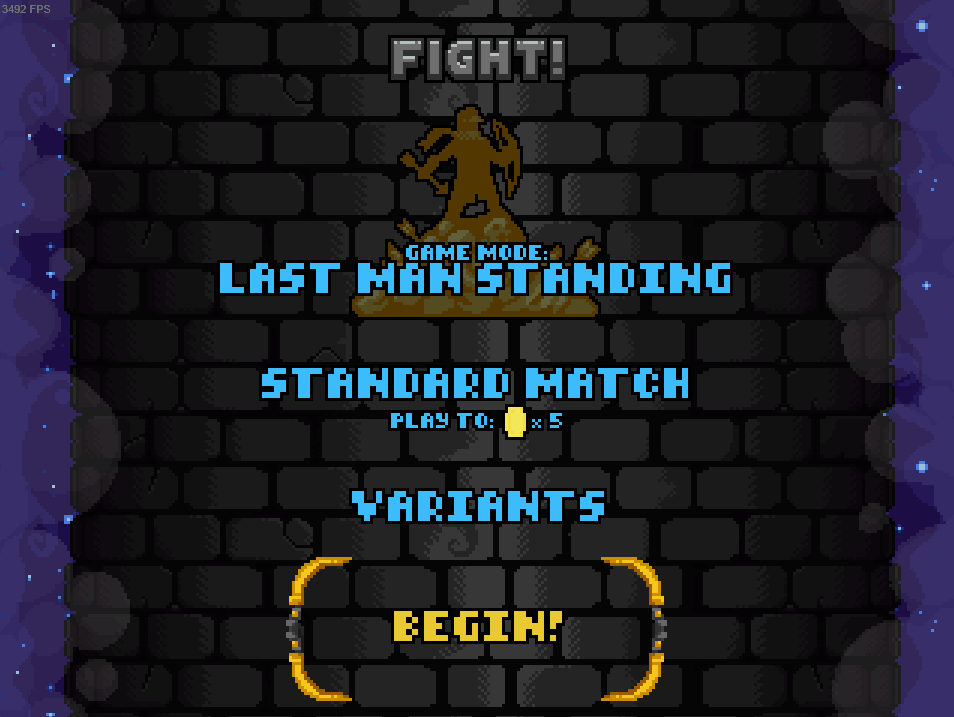

<!-- PROJECT LOGO -->
<br />
<div align="center">
  <a href="https://github.com/Fcornaire/TF.EX">
    
  </a>
  <h3 align="center">TF EX mod</h3>
</div>

<!-- Shield -->

[![Contributors][contributors-shield]][contributors-url]
[![Download][download-shield]][download-url]
[![Forks][forks-shield]][forks-url]
[![Stargazers][stars-shield]][stars-url]
[![Issues][issues-shield]][issues-url]
[![MIT License][license-shield]][license-url]

<!-- ABOUT THE PROJECT -->

# About The Project

TF EX is a mod that attempt to bring netplay to TowerFall (EX as a Fighting game EX move, usually costing meter). It use [FortRise](https://github.com/Terria-K/FortRise) + Rollback netcode as infrastructure.
Due to the nature of the project, the mod is also able to record + view precedents matchs.
Also, this is project is still super WIP !

# Feature

- Online Netplay

<p align="center">
  
</p>

2 new modes available, `Netplay Quickplay` and `Netplay Direct`

   <p align="center">
    
  </p>

- Replays

  Replay is "Normally" automatically exported at the end of a game.
  Use the `replays` menu to watch precedent games

  <p align="center">
    
  </p>

  <p align="center">
    
  </p>

# Usage

It fairly easy to use the mod:

1. Download and install [FortRise](https://github.com/Terria-K/FortRise) if not already
2. Download the latest TF EX [release](https://github.com/Fcornaire/TF.EX/releases)
3. Create a `Mods` directory at the root of your Towerfall install directory if not done already
4. Extract the `TF.EX` zip into the precedent `Mods` folder.
5. You are now ready and the mod should be referenced and loaded by FortRise

You have the option to change your tag in the in game option.
You can also change the input delay but leaving it 2 is a good start.

You should also be able to see 2 new versus mode (All the way to the right):

1. Netplay Quickplay : Play against a randomly choosed opponent 'close' to your location. Choose the mode and wait until the game find an opponent, then choose a character and play
2. Netplay Direct: Play against someone in particular (by exchanging code connection).

If you did played some matchs, a directory `Replays` should have been created in the Towerfall root directory.
You can view one of those game by:

1. Launching Towerfall
2. In the main menu, press ² to open it and enter the following command:

```
replay {replay_name}
```

whith {replay_name} being something like "20-06-2023T22-17-46" (No file extension)

# Troubleshooting

I advise to not use this mod with mods that do other thing than cosmetics/skins.
For eample [WiderSetMod](https://github.com/Terria-K/WiderSetMod) have been reported to break the mod
I will try to investigate why it's happening but for now,only use the TF EX mod as standalone

## There is a blank screen when i try to rematch

This is your game waiting for the oppoenent to rematch. It's not perfect. I hope in some next update, i will be able to have better UX to handle it

# Develop

This project use:

- [FortRise](https://github.com/Terria-K/FortRise) as the main loader (C#)
- [ggrs-ffi](https://github.com/Fcornaire/ggrs-ffi) which is a lib that expose [GGRS](https://github.com/gschup/ggrs) api to be called by non rust project (Rust)
- [matchbox-client-ffi](https://github.com/Fcornaire/matchbox-client-ffi) which is lib that expose some of the [matchbox](https://github.com/johanhelsing/matchbox) api to be called by non rust project (Rust)
- A matchmaking server which main source are not exposed for now, it manage matchmaking and also run a signaling endpoint for easier connection (Rust)

## Prerequisites

Install [FortRise](https://github.com/Terria-K/FortRise) with Debug ON , this can be changed by modifying the "PatchVersion.txt" file in the Towerfall root directory

## Installation

To be able to add feature or fix things, you will need to :

1. Clone the repo

   ```sh
   git clone https://github.com/Fcornaire/TF.EX.git
   ```

2. Launch the .sln with your favorite IDE
3. Do some modification and build. If you didn't change Towerfall original installation folder, the mod dll will be copied automatically each build to your game Towerfall directory. Be aware that except of Core.dll, the other are copied to the root of Towerfall installation directory which let's us debug.
4. Launch Towefall and on the main screen, open the Dev console wih the key ² (If not opening, ensure you enabled dev console in the game settings) and enter the following command

```
test LMS 0 1 42 2
```

A LastManStanding game should be running in a GGRS [SyncTestSession](https://github.com/gschup/ggrs/wiki/2.-Sessions#sessionbuilder)

<!-- ROADMAP -->

## Roadmap

As you can guess, this project is still WIP and missing a lot of feature:

- [ ] Automatically bump the version (meta + tag)
- [ ] Refacto (There is a lot of thing i want to refactor)
- [x] Less restrictive controller
- [ ] Fix bugs
- [x] Fix desynchronization (Atleat netplay code wise should be fine)
- [ ] Support for all versus map
- [ ] Check Twiligh Spear CrackedWall with teams on level 7
- [ ] Support all items
- [ ] Support 4 players (FFA and 2V2 teams )
- [x] Integrate the replay viewer in the menu

## Contributing

Whats the point of Github without contrib ? Any contributions you make are **greatly appreciated**.
But since there is a ton of things to do, i advise either contact me directly or create an issue explaining the missing feature or the bug fix before starting to code. This is only to know what you are tying to do, provide help if needed and check if it's not already done or in the work 😉

1. Fork the Project
2. Create your Feature Branch (`git checkout -b feature/cool-feature`)
3. Commit your Changes (`git commit -m 'feat: Add some cool Feature'`)
4. Push to the Branch (`git push origin feature/cool-feature`)
5. Open a Pull Request

<!-- LICENSE -->

## License

Distributed under the GPL-2.0 License. See `LICENSE` for more information.

The netplay logo can be found at [Icones8](https://icones8.fr/)

## Contact

Twitter : DShad - [@DShad66](https://twitter.com/DShad66)

Discord : dshad (was DShad#4670)

<!-- MARKDOWN LINKS & IMAGES -->
<!-- https://www.markdownguide.org/basic-syntax/#reference-style-links -->

[contributors-shield]: https://img.shields.io/github/contributors/Fcornaire/TF.EX.svg?style=for-the-badge
[contributors-url]: https://github.com/Fcornaire/TF.EX/graphs/contributors
[forks-shield]: https://img.shields.io/github/forks/Fcornaire/TF.EX.svg?style=for-the-badge
[forks-url]: https://github.com/Fcornaire/TF.EX/network/members
[stars-shield]: https://img.shields.io/github/stars/Fcornaire/TF.EX.svg?style=for-the-badge
[stars-url]: https://github.com/Fcornaire/TF.EX/stargazers
[issues-shield]: https://img.shields.io/github/issues/Fcornaire/TF.EX.svg?style=for-the-badge
[issues-url]: https://github.com/Fcornaire/TF.EX/issues
[license-shield]: https://img.shields.io/github/license/Fcornaire/TF.EX.svg?style=for-the-badge
[download-shield]: https://img.shields.io/github/downloads/Fcornaire/TF.EX/total?style=for-the-badge
[download-url]: https://github.com/Fcornaire/TF.EX/releases
[license-url]: https://github.com/Fcornaire/TF.EX/blob/master/LICENSE.txt
