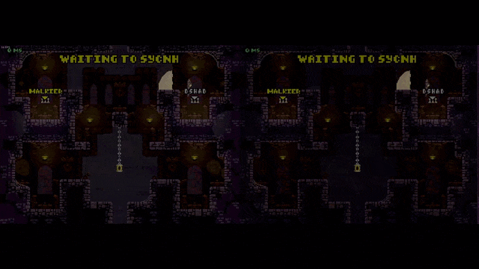
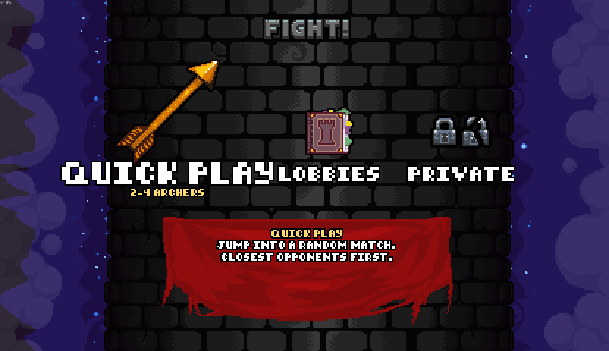
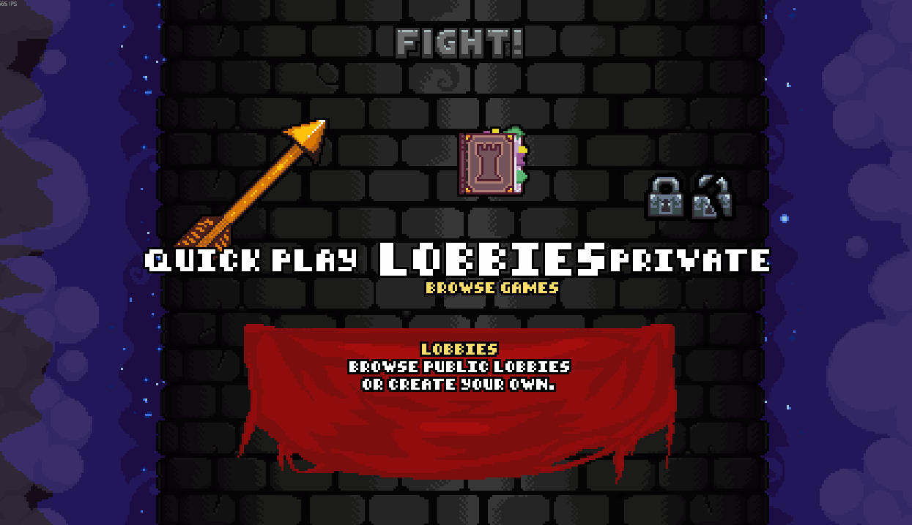
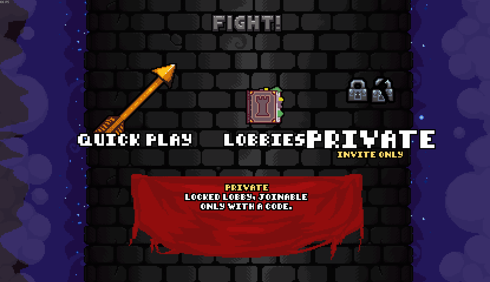
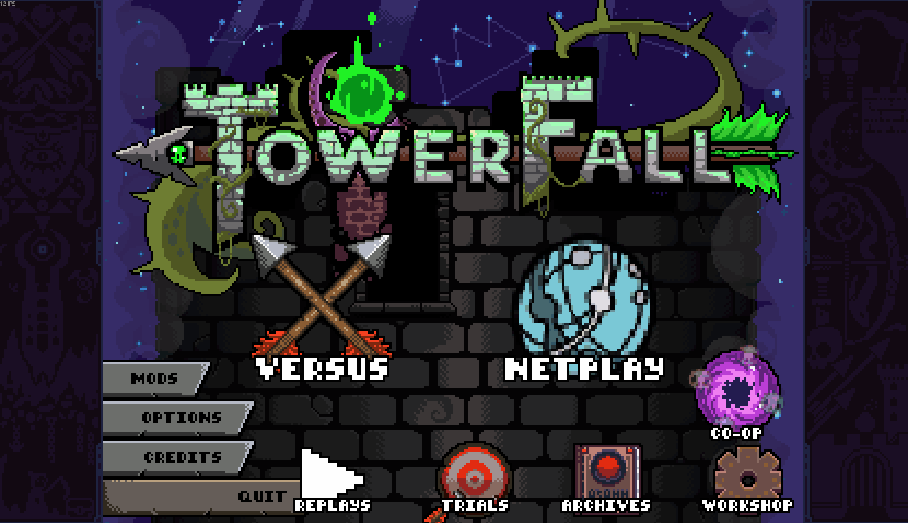

<!-- PROJECT LOGO -->
<br />
<div align="center">
  <a href="https://github.com/Fcornaire/TF.EX">
    
  </a>
  <h3 align="center">TF EX mod</h3>
</div>

<!-- Shield -->

[](https://patreon.com/DShadModdingAdventure)
[![Contributors][contributors-shield]][contributors-url]
[![Download][download-shield]][download-url]
[![Forks][forks-shield]][forks-url]
[![Stargazers][stars-shield]][stars-url]
[![Issues][issues-shield]][issues-url]
[![MIT License][license-shield]][license-url]

<!-- ABOUT THE PROJECT -->

# About The Project

TF EX is a mod that attempts to bring netplay to TowerFall (EX as in a Fighting game EX move). It uses [FortRise](https://github.com/Terria-K/FortRise) (the supported version is [5.4.0-rc.1
](https://github.com/FortRise/FortRise/releases/tag/5.4.0-rc.1))+ Rollback netcode as infrastructure.
Due to the nature of the project, the mod is also able to record + view previous matches.
Also, this project is still WIP!

The project ships as four mods, so the parts that are not about netplay can be used on their own:

| Mod                                                                | What it does                                                       |
| ------------------------------------------------------------------ | ------------------------------------------------------------------ |
| **TF.EX** ([API](EX-API.md))                                       | Online netplay with rollback                                       |
| **[TF.State](src/state/README.md)**                                | Saves and restores the level. The library both others are built on |
| **[TF.Replay](src/replay/README.md)**                              | Records matches, replay browser, seeking and GIF export            |
| **[TF.InputDisplayer](src/utilities/TF.InputDisplayer/README.md)** | Fighting game esque input displayer                                |

If you are a mod author making your own mod rollback/replay safe, [TF.State](src/state/README.md) is the
one to read.

# Features

- Online Netplay

<p align="center">
  
</p>

- Quickplay

<p align="center">
  
</p>

- Lobbies

<p align="center">
  
</p>

- Private lobbies

<p align="center">
  
</p>

- Replays (via **[TF.Replay](src/replay/README.md)** )

  <p align="center">
    
  </p>

# Usage

It fairly easy to install this mod:

1. Install [FortRise](https://github.com/Terria-K/FortRise)
   > [!WARNING]  
   > The last supported version is [5.4.0](https://github.com/FortRise/FortRise/releases/tag/5.4.0-rc.1), This mean the mod won't load/work on version 4.X.X and older or even beyond.
2. Download the latest TF EX [release](https://github.com/Fcornaire/TF.EX/releases) (`DShad.TF.EX-vX.Y.Z.zip` bundles the four mods; the other zips are the standalone parts)
3. Create a `Mods` directory in the FortRise folder downloaded
4. Extract the zip into the `Mods` folder (you should end up with `Mods/DShad.TF.EX`, `Mods/DShad.TF.Replay`, `Mods/DShad.TF.State` and `Mods/DShad.TF.InputDisplayer`)
5. Launch `FortRise.exe` in FortRise folder directly, it will launch and patch Towerfall directly

After that first install the mod keeps itself up to date: when you enter NETPLAY it checks for a new version.
Online play always requires the latest version.

# Options (Each standalone mod have his options)

All options live in the in-game `OPTIONS` menu or with FortRise mods buttons.

TF.EX options:

| Option                    | Default    | What it does                                                                                                                                                                                                                      |
| ------------------------- | ---------- | --------------------------------------------------------------------------------------------------------------------------------------------------------------------------------------------------------------------------------- |
| `INPUT DELAY`             | `2`        | Frames of local input delay (0-20). Less delay plays better but rollbacks more, more delay rollbacks less but feels clunky. Find your sweetspot                                                                                   |
| `AUTO ADJUST INPUT DELAY` | `PROPOSE`  | Adapts the input delay to the connection when joining a lobby: `PROPOSE` shows a suggestion (based on the laggiest player's ping) you can accept or ignore, `ENABLED` applies it automatically. Your saved value is never changed |
| `CUSTOM SKINS`            | `FULL`     | Show opponents' custom archer skins. Skins are visual only, streamed in memory and never saved                                                                                                                                    |
| `NETPLAY NAME`            | `PLAYER`   | Your player name, shown to opponents in lobbies and matches                                                                                                                                                                       |
| `SERVER`                  | `OFFICIAL` | The matchmaking server to connect to. Displays `OFFICIAL`, `LOCAL` or `CUSTOM`                                                                                                                                                    |
| `AUTO UPDATE`             | `ON`       | Downloads and applies the latest version automatically when entering netplay. Even with it disabled, online play still requires the latest version                                                                                |

The other mods' options are documented in their own README: **[TF.Replay](src/replay/README.md)** and **[TF.InputDisplayer](src/utilities/TF.InputDisplayer/README.md)** (TF.State has none).

# Replays

Recorded matches are browsable in game: the main menu has a `REPLAYS` button with a browser (play, seek, take over, export as GIF...).

On disk, replays are stored in `FortRise/Saves/TF.Replay/Replays` and GIF exports land in `FortRise/Saves/TF.Replay/Gifs`.

# Playing with other mods

- Cosmetic mods (skins, custom archers...) are fine. With `CUSTOM SKINS` enabled, your custom archer is even streamed to opponents that don't have the mod.
- [WiderSetMod](https://github.com/Terria-K/WiderSetMod) is fully supported: wide players match together in wide netplay lobbies.
- Mods that change gameplay (custom variants...) are hidden in netplay unless the mod integrates with [TF.State](src/state/README.md) so its state can be tracked by the rollback. If you author such a mod, that README explains how.

# Develop

This project uses:

- [FortRise](https://github.com/Terria-K/FortRise) as the main loader (C#)
- [ggrs-ffi](https://github.com/Fcornaire/ggrs-ffi) which is a library that allows the [GGRS](https://github.com/gschup/ggrs) API to be called by non-rust projects (Rust)
- A matchmaking server that manages matchmaking (quickplay, lobbies, private codes) and also runs a signaling endpoint for easier connection (Rust)

## Installation

To be able to add features or fix things, you will need to:

1. Clone the repo

   ```sh
   git clone https://github.com/Fcornaire/TF.EX.git
   ```

2. Launch the .slnx with your favorite IDE
3. Do some modifications and build. If you didn't change Towerfall original installation folder, the mod dll will be copied automatically each build to your game Towerfall directory. Be aware that with the exception of Core.dll, the others are copied to the root of Towerfall installation directory which lets us debug.
4. Launch Towerfall and on the main screen, open the Dev console wih the key ² (If not opening, ensure you enabled dev console in the game settings) and enter the following command

```
test LMS 0 1 42 2
```

A Last Man Standing game should be running in a GGRS [SyncTestSession](https://github.com/gschup/ggrs/wiki/2.-Sessions#sessionbuilder)

<!-- ROADMAP -->

## Roadmap

As you can guess, this project is still WIP and missing a lot of features:

- [ ] Automatically bump the version (meta + tag)
- [ ] Refactor (There is a lot of things I want to refactor)
- [x] Less restrictive controller
- [?] Fix bugs
- [x] Fix desynchronization (At least netplay code wise should be fine)
- [x] Support for all versus maps
- [ ] Check Twilight Spire CrackedWall with teams on level 7
- [x] Support all items
- [x] Support 4 players (FFA and 2V2 teams )
- [x] Integrate the replay viewer in the menu

## Contributing

What's the point of Github without contributions? Any contributions you make are **greatly appreciated**.
But since there is a ton of things to do, I advise either contact me directly or create an issue explaining the missing feature or the bug fix before starting to code. This is only so I know what you are tying to do, provide help if needed and check if it's not already done or in the works 😉

1. Fork the Project
2. Create your Feature Branch (`git checkout -b feature/cool-feature`)
3. Commit your Changes (`git commit -m 'feat: Add some cool Feature'`)
4. Push to the Branch (`git push origin feature/cool-feature`)
5. Open a Pull Request

<!-- LICENSE -->

## License

Distributed under the GPL-2.0 License. See `LICENSE` for more information.

The netplay logo can be found at [Icones8](https://icones8.fr/) but was re drawed in pixel art.

## Contact

Twitter : DShad - [@DShad66](https://twitter.com/DShad66)

Discord : dshad (was DShad#4670)

<!-- MARKDOWN LINKS & IMAGES -->
<!-- https://www.markdownguide.org/basic-syntax/#reference-style-links -->

[contributors-shield]: https://img.shields.io/github/contributors/Fcornaire/TF.EX.svg?style=for-the-badge
[contributors-url]: https://github.com/Fcornaire/TF.EX/graphs/contributors
[forks-shield]: https://img.shields.io/github/forks/Fcornaire/TF.EX.svg?style=for-the-badge
[forks-url]: https://github.com/Fcornaire/TF.EX/network/members
[stars-shield]: https://img.shields.io/github/stars/Fcornaire/TF.EX.svg?style=for-the-badge
[stars-url]: https://github.com/Fcornaire/TF.EX/stargazers
[issues-shield]: https://img.shields.io/github/issues/Fcornaire/TF.EX.svg?style=for-the-badge
[issues-url]: https://github.com/Fcornaire/TF.EX/issues
[license-shield]: https://img.shields.io/github/license/Fcornaire/TF.EX.svg?style=for-the-badge
[download-shield]: https://img.shields.io/github/downloads/Fcornaire/TF.EX/total?style=for-the-badge
[download-url]: https://github.com/Fcornaire/TF.EX/releases
[license-url]: https://github.com/Fcornaire/TF.EX/blob/master/LICENSE.txt
