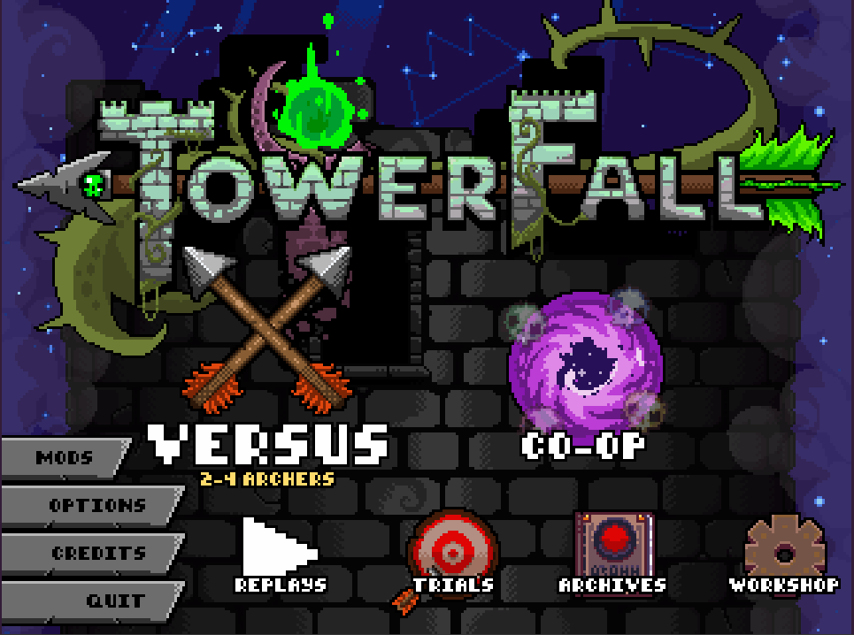
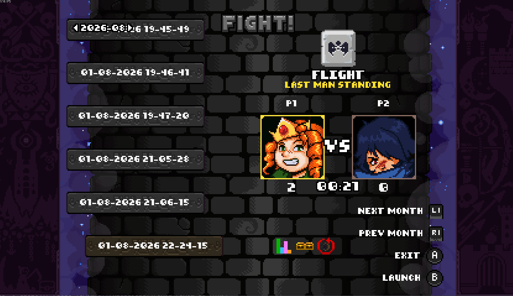
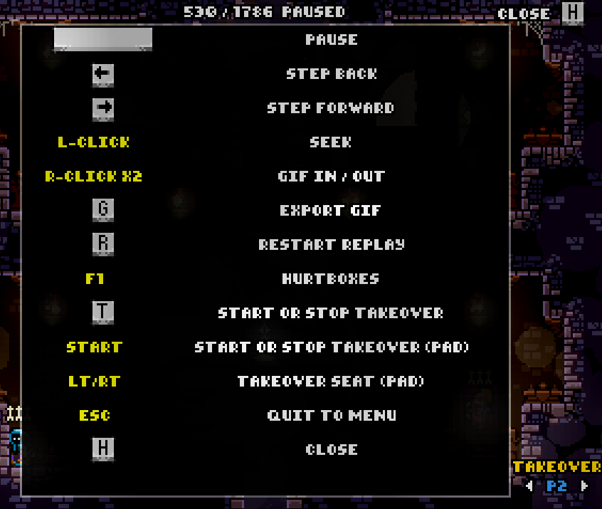
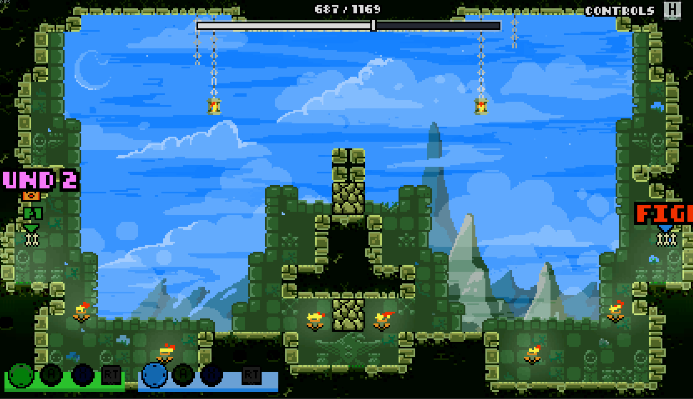
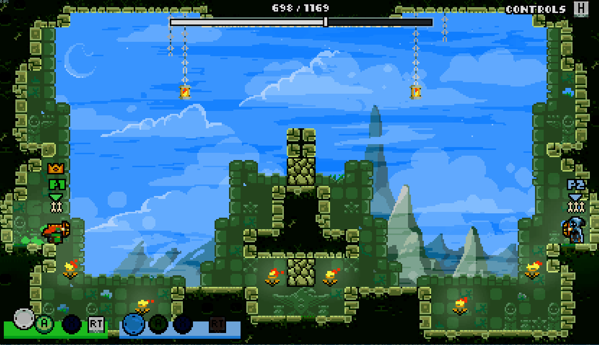
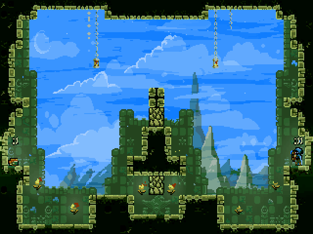
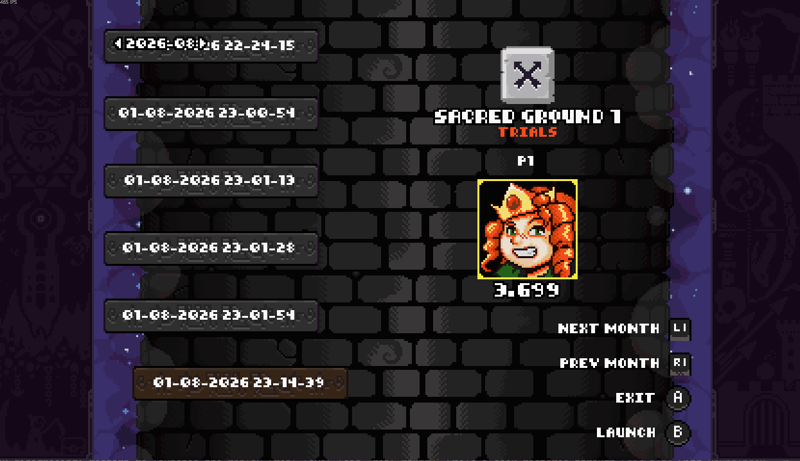
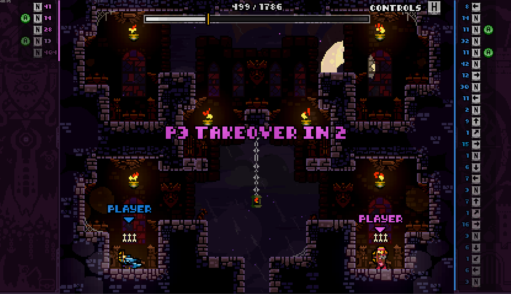

# TF.Replay

Records TowerFall matches and plays them back; frame by frame, seekable, exportable as a GIF.

A replay is not a video: it stores the **inputs** of every frame plus periodic state snapshots, and the
game re-simulates from them

# Features

## Replay browser

Browse all replay saved. A replay is exported at the end of Versus and Trials (No quests) , configurable in the mod options.
A replay is exported by his month

<p align="center">
  
</p>

## Playback

Launch a replay from the browser and watch the replay play

<p align="center">
  
</p>

Press H to view Control options

<p align="center">
  
</p>

You can pause, advance frame by frame, go back, restart , and the new star : the Seek bar !
It let you with your mouse directly seek to the frame you want

<p align="center">
  
</p>

You can also export gif : use 2 right clicks to select the frames frontier and press G to export the gif (the gif lands in `<TowerFall>/FortRise/Saves/TF.Replay/Gifs`)

<p align="center">
  
</p>

and the result

<p align="center">
  
</p>

You can record all mods except quest

<p align="center">
  
</p>

## Replay Takeover

<p align="center">
  
</p>

At any point of a versus replay you can **take the seat of an
archer and play the round yourself**, while the other archers keep replaying their recorded inputs

- Pick the seat with the `< PX >` selector at the bottom right (click the arrows with the mouse, or
  `LT`/`RT` on a pad)
- Press `T` (keyboard) or `Start` (pad) :The device that pressed is the one that plays
- A gold marker on the seek bar shows the frame the takeover branched from

The takeover ends :

- the moment the live round ends (round or match results)
- otherwise ~100 frames after the point where the **recorded** round had ended with a guaranteed minimum of 5 seconds of play
- or instantly by pressing `T`/`Start` again, which resumes the replay right where you took over

Works in both standalone playback and TF.EX-driven playback

# Install

1. Install [FortRise](https://github.com/Terria-K/FortRise) 5.3.0 (5.X version at least)
2. Extract the release into `Mods/`

Requires **[TF.State](../state/README.md)** (which is bundled automatically if you get the pre release zip)

# Recording

Recording is automatic — TF.Replay records local matches on its own, and [TF.EX](../../EX-API.md), if
installed, takes over for netplay matches. Either way the replay is exported at the end
of a match, to:

```
<TowerFall>/FortRise/Saves/TF.Replay/Replays/yyyy-MM/<timestamp>.tow
```

Monthly folders keep the list navigable

Which modes get recorded is a toggle in the mod's options page (`OPTIONS` → `MOD OPTIONS` → `TF REPLAY`):

- `RECORD LAST MAN STANDING`
- `RECORD HEADHUNTERS`
- `RECORD TEAM DEATHMATCH`
- `RECORD TRIALS`

The `SAVE STATE` option picks how much game state a recording keeps:

- `FULL` (default) saves the state every frame, it give exact frame stepping, but a match replay takes more disk space
- `KEY` saves a few states per second, much smaller files, but going back or seeking snaps to the last saved state

The choice only matters at recording time (playback handles both).

## Controls

Press `H` in a replay for the same list on screen.

| Input           | Action                                                       |
| --------------- | ------------------------------------------------------------ |
| `Space`         | Pause / resume                                               |
| `Left`          | Step back one frame (`KEY` replays: to the last saved state) |
| `Right`         | Step forward one frame (hold `Down` to run)                  |
| Left click      | Seek — hold and drag to scrub                                |
| Right click     | Mark GIF in, then out (a third restarts)                     |
| `G`             | Export the marked range as a GIF                             |
| `F1`            | Toggle hurtboxes (needs TF.EX)                               |
| `T`             | Start or stop a takeover                                     |
| `Start` (pad)   | Start or stop a takeover                                     |
| `LT`/`RT` (pad) | Change the takeover seat                                     |
| `Esc`           | Quit to the main menu                                        |
| `H`             | Show / hide the controls panel                               |

## GIF export

Right-click the seek bar twice to mark the range, then `G`. The GIF is written next to the replay:

```
<replay folder>/<replay name>_<inFrame>-<outFrame>.gif
```

320×240 at 2× scale, capped at 200 captured frames ; a longer selection lowers the frame rate rather
than being truncated

# API

For mods that want to record or drive playback themselves. Resolve it through FortRise:

```C#
var replay = context.Interop.GetApi<IMyReplaySlice>("TF.Replay");
```

The surface covers recording (`BeginRecording`, `AddRecord`, `Export`), playback (`StartPlayback`,
`SeekTo`, `UpdatePlaybackControls`), queries (`GetInputsAtFrame`, `GetStateAtFrame`) and the metadata a
netplay host pushes in (seats, archers, teams, seed). See `TF.Replay.Domain/Ports/ITfReplayApi.cs`.

**The record-driver lease** `SetRecordDriver(yourModName)` tells TF.Replay you own the frame loop, and
it stands its own drivers down; pass `null` to release, on teardown _and_ on unload
