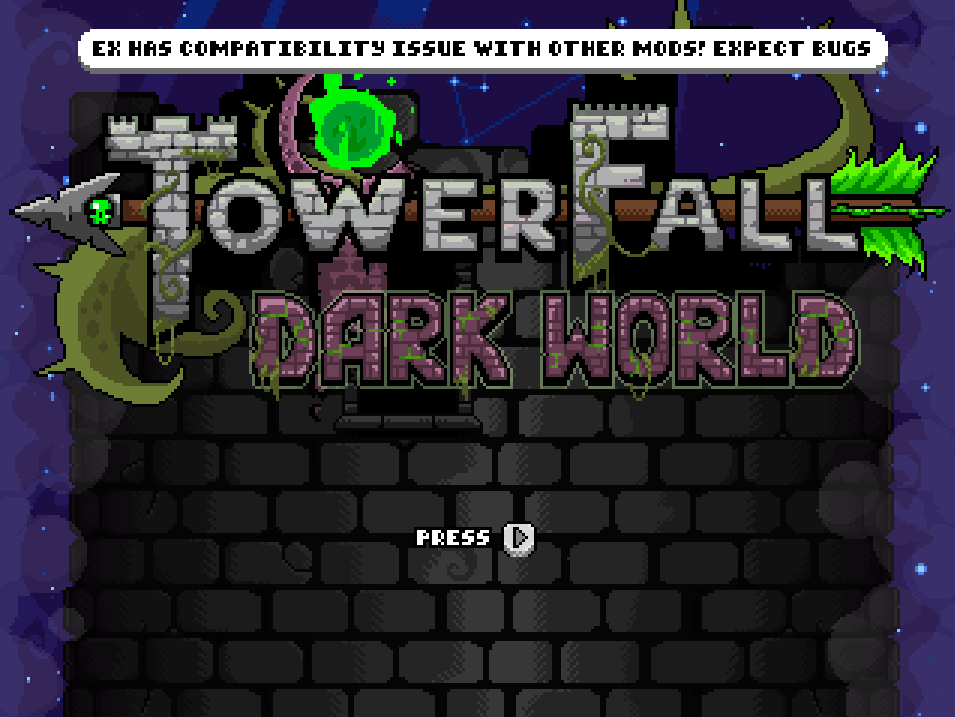

# TF.State

A library mod. It has no gameplay of its own: it knows how to **save and restore a TowerFall level**.

`GetState` walks the live `Level` , every tracked entity, the players and their physics flags, arrows,
pickups, chests, the per-round data, the session, the RNG , and serializes it to an opaque `byte[]`.
`LoadState` puts it back, exactly, on any later frame.

Two mods are built on it:

- [TF.EX](../../EX-API.md) — rollback netplay. Rollback _is_ save/restore, several times a frame.
- [TF.Replay](../replay/README.md) — recording, playback and frame-accurate seeking.

If you write a mod that adds state of its own, TF.State is the mod you talk to so that state survives a
rollback or a replay seek — whether or not the player has TF.EX installed.

# Install

1. Install [FortRise](https://github.com/Terria-K/FortRise) 5.3.0
2. Extract the release into `Mods/`

TF.State is also pulled in as a dependency by TF.EX and TF.Replay, so you usually already have it.

# API

## Mod interop

The everyday surface, imported by name with MonoMod's `ModInterop`:

```C#
 /// <summary>
 /// Register custom SaveState/LoadState events for a variant.
 ///
 /// <para>Those are used by the rollback system to properly save/load variant custom properties</para>
 /// </summary>
public static Action<Mod, string, Func<byte[]>, Action<byte[]>> RegisterVariantStateEvents;
```

```C#
 /// <summary>
 /// Stop receiving SaveState/LoadState events for a variant.
 /// </summary>
public static Action<Mod, string> UnregisterVariantStateEvents;
```

```C#
 /// <summary>
 /// Mark a module as netplay safe.
 ///
 /// <para>This is only to prevent EX showing a warning when a mod is loaded.</para>
 ///
 /// <para> It does not automatically mean the mod is compatible and test should be done first. </para>
 /// </summary>
public static Action<Mod> MarkModuleAsSafe;
```

`MarkModuleAsSafe` is used to prevent showing this notification



⚠ Again, this does not make the mod compatible, it only prevents showing the compatibility notification, so only use this if you know your mod is compatible! ⚠

It also lets your mod's pickups through the treasure spawner, which otherwise drops anything it cannot
account for.

See `TF.State.Domain/Ports/ITfStateApi.cs` for the full surface.

## Reading a state

A state is an opaque `byte[]` for the reason above: the model cannot cross the mod boundary. So
TF.State decodes on your behalf and hands back plain types:

```C#
int      GetFrameOf(byte[] state);
string[] DescribePlayers(byte[] state);              // "index;position;speed;state" per player
string   DescribeState(byte[] state, int maxDepth);  // whole blob as text, 0 = default depth
string   CompareStates(byte[] a, byte[] b);
string   DumpEntities();                             // the LIVE level, not a blob
```

`DescribeState` is the escape hatch: it walks the decoded model and prints every field, capped at 64
entries per collection. It is for looking, not for parsing — the shape is the model's and changes with
it. If your mod needs a specific value on an ongoing basis, ask for a typed member instead and it can
be added to the API.

Note that you usually do **not** need any of this: the live `Level` and its entities are reachable
directly from your own mod.

# Modded variants

TF.State can carry custom variants through rollback and replay as long as the mod is made compatible.

It's your responsibility to make sure the mod is netplay compatible (Ask the mod author).

## Making a custom variant compatible (For developers)

This guide will help you implement your modded variant for netplay sessions.

Note that this isn't a simple process as both mods can conflict.

You can also look at this [PR](https://github.com/FortRise/ExampleFortRiseMod/pull/1) which makes Jester Hat variant compatible.

### Prerequisites

There are 3 rules of thumb (and the first one is very important) for making your mod compatible:

- Your mod does not interfere with TF.State's or TF.EX's patches. There isn't a specific rule but some
  patches require initial setup before executing the original method.

So for example, some patches check some RNG call to be able to track them; patching the same function make the original get called without being able to register the RNG stuff. (Maybe in the future, this will be handled differently)

You can check the `TF.State.Patchs` and `TF.EX.Patchs` projects to see what's being patched. I don't have a good solution right now other than contacting me to see how your patches are going to affect them.

- Your custom variant acts deterministically. That means applying the same input on an X frame always results in the same Y frame every time.

- Your are only saving/loading the custom part of your variant. That means you shouldn't try (for example) to save the player's position, because it's already done by TF.State. You should only focus on the things that are specific to your mod.

### Context

Although I recommend having at least a basic knowledge of how rollback netcode works (there are some great explanations/videos on the web), it's not mandatory for making the mod compatible.

TF.State already manages the work of saving/loading important pieces of information (State), it only needs what should be saved/loaded from your mod.

It uses an interop API to be able to let your mod interact with it.

```C#
public static Action<Mod, string, Func<byte[]>, Action<byte[]>> RegisterVariantStateEvents;
```

This function takes 4 parameters:

- A Mod (aka your core mod) used for identification
- A string that is the name of the modded variant
- A function that returns a byte[] (SaveState)
- A function that takes a byte[] (LoadState)

Let's look at the last two since they are more important:

- The `SaveState` delegate: a function that will return a serialized version of the custom variant state as a byte[].

That means it's your responsibility to know what your custom variant adds to the game.

- The `LoadState` delegate: a function that takes a serialized version of the mod state and expects you to load it.

The payload is opaque to TF.State: it rides inside the snapshot, so it must be deterministic and must
not depend on anything outside the simulation (wall-clock time, `Calc.Random` outside a tracked bracket,
the local player's settings...).

### Implementation

#### Import the mod

This is straightforward. Create a class like this one:

```C#
    [ModImportName("TF.State.API")]
    public static class TfStateAPIModImports
    {
        public static Action<Mod, string, Func<byte[]>, Action<byte[]>> RegisterVariantStateEvents;

        static TfStateAPIModImports()
        {
            typeof(TfStateAPIModImports).ModInterop();
        }
    }
```

`[ModImportName("TF.State.API")]` is for MonoMod to be able to find the TF.State mod.

`static TfStateAPIModImports()` is just the constructor that will automatically make MonoMod detect TF.State mod.

Add TF.State to your `meta.json` dependencies so FortRise loads it first:

```json
"dependencies": [ { "name": "TF.State", "version": "1.0.0" } ]
```

#### Register the custom Save/Load delegate

Call the previous delegate with something like this:

```C#
TfStateAPIModImports.RegisterVariantStateEvents(this, "customVariantName", OnSaveState, OnLoadState);
```

with `OnSaveState` being your save state delegate and `OnLoadState` being your load state delegate.

Note the register function should be called **after** all mods finish loading, not while the mod is
loading — from your module's `OnInitialize`, not its constructor.

### Testing

You can test with TF.EX installed, by launching it in **test mode**, which is a special mode that triggers a rollback every `check_distance` frame and checks if the state on each frame is the same. (equality by checksum)

For example, with a `check_distance` at 2, the game will rollback every 2 frames.

If there is a checksum mismatch, there will be an exception thrown that will show why the mismatch happened. (`DeepEqual.dll` is needed for that!)

You can launch EX test mode by launching Towerfall, open the console by pressing ² and paste a command like

`test LMS 1 2 3 4 JESTERS_HAT`

with

- test : the mode we are lauching
- LMS : Last Man Standing
- 1 : the level where we should start
- 2 : the map where we should play
- 3 : the seed (for RNG) we want to apply
- 4 : the check distance (can be from 2 to 7)
- JESTERS_HAT: the title name of the variant we want to test, with spaces replaced by underscores

A sync test runs in a single process, so it catches "the same code produced two different states" but
never "this value is random on each machine and never shared". For that class of bug, two real clients
are the only test.
