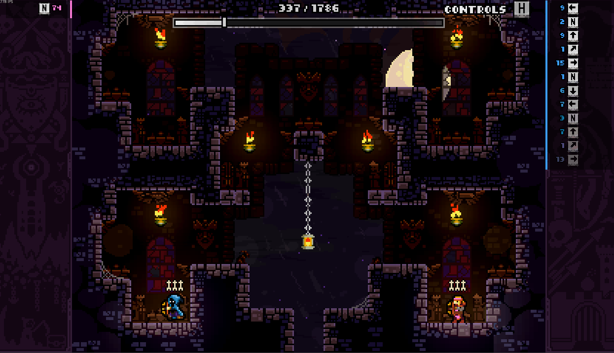
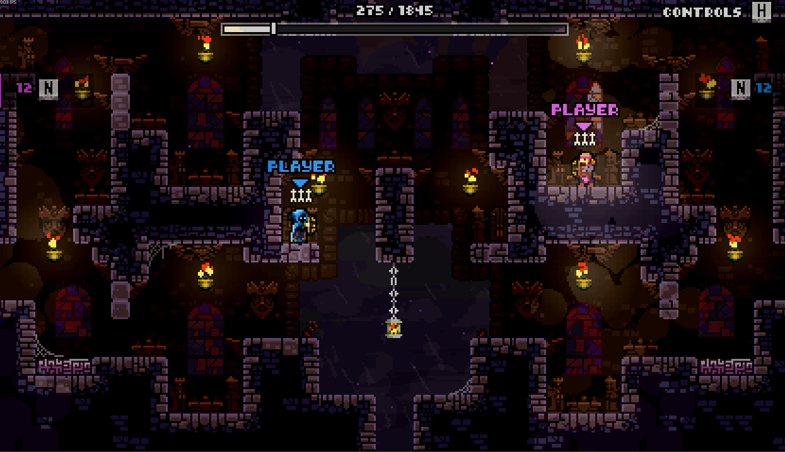

# TF.InputDisplayer

A fighting-game style input history overlay for TowerFall (FortRise 5.X+).

<p align="center">
  
</p>

Each row is one distinct input, a direction plus the buttons held with it , and the
number on the outside is how many frames that input lasted before it changed. Newest
row is on top, older rows fade out below it.

Work with wider set also

<p align="center">
  
</p>

## Where it shows

- **The vanilla instant replay** (the rewind after a kill)
- **TF.Replay playback**
- **TF.EX spectator mode**, a button guide on the bottom line offers `I` inputs on/off, `+` / `-` opacity and `G` to hide the guide
  itself.

## Layout and placement

Players 1 and 3 go on the left, players 2 and 4 on the right (mirrored), so a 1v1 reads
like a fighting game. Compatible with [WiderSet](https://github.com/FortRise/ExampleFortRiseMod/tree/main/WiderSet)

## Settings

| Setting                  | Default | Notes                                    |
| ------------------------ | ------- | ---------------------------------------- |
| `INPUT DISPLAY`          | on      | Switch On/Off                            |
| `SHOW IN INSTANT REPLAY` | on      | Off leaves the vanilla input strip alone |
| `HISTORY ROWS`           | max     | Upper bound only                         |
| `OPACITY`                | 10      | Opacity of the displayer                 |

## API

Other mods can drive the display over the FortRise interop API (`TF.InputDisplayer`):

```csharp
public interface IInputDisplayerApi
{
    int ApiVersion { get; }
    bool IsEnabled { get; }
    void SetEnabled(bool enabled);
    void StepOpacity(float direction);
    void BeginSession(int seatCount);
    void PushSeat(int frame, int seat, int moveX, int moveY, bool jump, bool shoot, bool altShoot, bool dodge, bool jumpPressed, bool shootPressed, bool altShootPressed, bool dodgePressed);
    void RenderAt(int frame);
    void EndSession();
}
```

The pressed flags are the per frame press edges, a press edge on a button that is already held (two physical bindings for example excuting a dash cancel require a second dash button) splits the history row instead of merging into one long hold.
